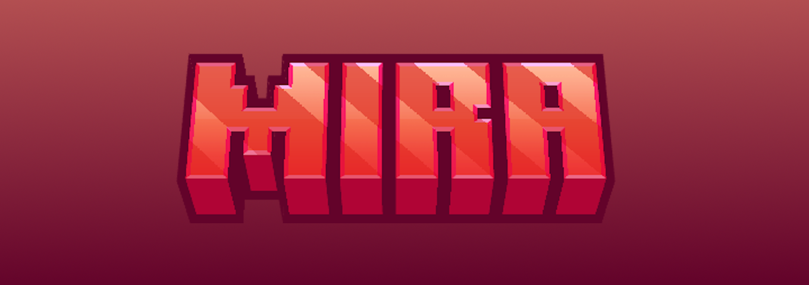

## Présentation

### Serveur en général
Mira est un serveur Minecraft Bedrock francophone de type PvP Faction sur un thème fantastique fondé par [@swit_azya](https://discord.com/users/762264222058676234) en Juin 2024.

Nos objectifs sont de vous proposer une expérience de jeu **flexible** pouvant accueillir **tout types de joueurs** et de vous faire vivre une **expérience de jeu inédite** à travers tout le contenu proposé.
 
Vous y retrouverez : 
- De tout nouveaux équipements tels que des **armures, outils et breuvages spéciaux**
- Des machines permettant de **confectionner votre équipement** ou de le **perfectionner**
- Des **systèmes de quêtes**, de **métiers** et de **factions** intuitifs et de qualité 
- Un gameplay pillages revisité proposant des artifices exclusifs
- Des **évènements entre factions**, **évènements semi-privés** et **évènements saisonniers**
### Informations utiles
Site officiel : 

Wiki : 

Boutique :

Discord : 

YouTube :

Contact PRO : [@swit_azya](https://discord.com/users/762264222058676234) / mcbe.mira@gmail.com

> [!Note]
> Actuellement en développement et projet privé.
