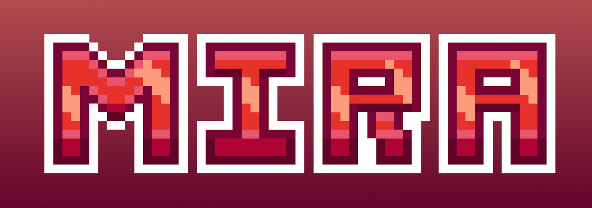

## Présentation

### Serveur en général
Mira est un serveur Minecraft Bedrock francophone, de type **PvP Faction** et à **thème fantastique**.
Nos objectifs sont de vous proposer une expérience de jeu **immersive et innovante**, ouverte à tout **types de joueurs**, que vous soyez un voyageur solitaire, un guerrier audacieux, ou un stratège de faction.
### Contenu
Ce que vous trouverez sur notre serveur :
- **Equipements exclusifs :** de nouvelles **armures**, **armes** et **breuvages** pour prendre part au combat
- **Système d'enchantements revisité :** proposant de **nouveaux enchantements** ainsi qu'une **table d'enchantement spéciale**
- **Système de quêtes :** missions à accomplir pouvant être des quêtes de **tutoriel**, **hebdomadaires**, de **factions** et **saisonnières**
- **Système de métiers :** manière structurée de **d'atteindre des niveaux** afin de débloquer des **récompenses**
- **Evènements :** évènements rapides, semi privés, entre factions et saisonniers
- **Gameplay pillage exclusif :** de nouveaux artifices conçus pour **défendre** vos bases ou **attaquer** celles d'autres joueurs
- **Cosmétiques** : cosmétiques en tout genre dont des cosmétiques obtenables **gratuitement**
### Réseaux sociaux et contact
Wiki : il regroupe l'ensemble des informations que ce soit sur le gameplay ou les différents systèmes disponibles ainsi que des conseils pratiques : https://www.mcpe.mira.fr/wiki.

Boutique : Propose des grades, des cosmétiques ou autres artifices pouvant vous procurer davantage de confort de jeu : non disponible pour le moment.

YouTube : nous y postons des spoils, rediffusions de conférences / évènements et trailers : https://www.youtube.com/@MiraMCBE.

Contact PRO :
- E-mail : mcbe.mira@gmail.com
- Discord : [@swit_azya](https://discord.com/users/762264222058676234) 

> [!Note]
> Actuellement en développement et non annoncé publiquement.
